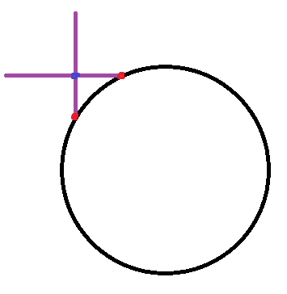

# shadertrixx

~~CNLohr's repo for his Unity assets and other shader notes surrounding VRChat.  This largely contains stuff made by other people but I have kind of collected.~~

Needed a repo to write down notes so I forked CNLohr's repo as a starting point since it's well organized otherwise I will probably just find myself asking the same questions over and over again.

## tessellation.unitypackage
The only method to reconstruct normal after tessellating that seems to work is bgolus's method for converting height to normal which uses ddx/ddy but anything to approximate the normal by n-tap depth sampling doesn't seem to work and idk we get really weird normals with tessellated edges 

could try creating fake vertices by transforming tangents by the normal map output from depth

we could try a seperate pass and rendertexture that generates normalmap in to rendertexture and read it back in as sanity check, another alternative is we can compare p1-p0 and p2-p0 and then cross product but also this could be related (as in the same exact problem) as to why it's problematic to raymarch heightmaps? (see this image by pema)



## pema 3d sdf jfa thing
For every cell in the volume, get the UV on each depth texture that lines up with that cell. If all cameras see something at their respective UV, place a seed in the cell.
With a cube of ortho cameras the "Get UV of each depth texture part" is pretty much just a matter of swizzling the coordinates of the cell and taking 2 of them as the UV
i.e.:
```hlsl
                float f = _Front[volCoord.xy].r;
                float b = _Back[uint2(volSize-1-volCoord.x, volCoord.y)].r;
                float l = _Left[volCoord.zy].r;
                float r = _Right[uint2(volSize-1-volCoord.z, volCoord.y)].r;
                float d = _Down[volCoord.xz].r;
                float u = _Up[uint2(volCoord.x, volSize-1-volCoord.z)].r;

                if (f > 0 && b > 0 && l > 0 && r > 0 && d > 0 && u > 0) ... something is here
```
Where you put the volSize - ... stuff will obviously depend on how your cameras are oriented and volCoord in this case is the just 3D coords of the cell
btw make sure you read below if you want to know what volCoord is


d4rkplayer's cloning thing (keep this in mind)

just invert proj matrix and yeet the screen pos + depth through it
```hlsl
mul(inverse(UNITY_MATRIX_P), float4(screenPos.x, screenPos.y, depthTextureSample, 1))
```

more pema
8 4k textures, one for each pass. Depth textures are 256x since they only capture one side of the volume. No color texture. Seed texture is also 4k
jump flooding you store the coordinates of the seed that is closest to the texel in the texel itself, hence the texture format
10 bits is enough to store 256 distinct values per channel

d4rkplayer:
for each pixel in each depth camera calculate world pos and then cell pos and put it in geom shader
using geoms as arbitrary write ops is pretty powerful


This is here not as source code implementation hinting but rather just to conceptually illustrate to you (me) effectively what JFA functionality provides for each pass 

 keep in mind the seed volume is just an input to the first pass and then the JFA passes handle the rest of it.
from neitri:
something like this to build the 3d sdf (result)
run few iterations of shader with decreasing jump fill distance like 128, 64, 32, 16, 8, 4, 2
input is the 1/0 seed volume, and previous result
with every iteration you increase output resolution by 2
every iteration result also serves as LOD for the sphere tracing
int32 inCurrentCell;
bool bIsSeedOccupied = false;
for (int i=0; i<27; ++i)
{
    bIsSeedOccupied = bIsSeedOccupied || inSeed3dVolume[inCurrentCell + directions[i] * jumpFillDistance];
}
float shortestDistanceOfNeighbours = FLOAT_MAX;
for (int i=0; i<27; ++i)
{
    shortestDistanceOfNeighbours = min(shortestDistanceOfNeighbours, inPreviousSdfResult[inCurrentCell + directions[i] * jumpFillDistance);
}
return min(shortestDistanceOfNeighbours, bIsSeedOccupied * jumpFillDistance);

with every iteration you increase output resolution by 2
every iteration result also serves as LOD for the sphere tracing

## pema 3d vol indexing thing bmcommon.cginc 

here's specifically JUST the important parts you need to know
note that 4096 and 256 specifically have this property that sqrt of number cubed gives integer i.e: sqrt(256^3) = 4096
won't work with 128 because sqrt(128^3) = some fraction of a whole number
512 and 64 work because sqrt(64^3) = 512 if you need something smaller
I forget the actual term for this  

```hlsl
static const uint densityTexSize = 4096;
static const uint densityVolSize = 256;
static const float invDensityTexSize = 2.0 / densityTexSize; // 2 to match size of cube


uint Idx3to1(uint3 p, uint size) {
    return p.x + size*p.y + size*size*p.z;
}

uint3 Idx1to3(uint idx, uint size) {
    uint x = idx % size;
    uint y = (idx / size) % size;
    uint z = idx / (size * size);
    return uint3(x, y, z);
}

uint Idx2to1(uint2 p, uint size)
{
    return p.x + size * p.y;
}

uint2 Idx1to2(uint idx, uint size)
{
    uint x = idx % size;
    uint y = idx / size;
    return uint2(x, size-1-y); // textures are usually flipped w.r.t world coords on y axis
}

uint2 VolToTex(uint3 volCoord)
{
    uint volIdx = Idx3to1(volCoord, densityVolSize);
    uint2 texCoord = Idx1to2(volIdx, densityTexSize);
    return texCoord;
}

uint3 TexToVol(uint2 texCoord)
{
    uint texIdx = Idx2to1(texCoord, densityTexSize);
    uint3 volCoord = Idx1to3(texIdx, densityVolSize);
    return volCoord;
}```

## Note about lights and particle systems
You can drag a light as a thingy onto a particle system and this lets you get around the 1 light limit for avatars and you can use uimenu for culling mask. 

## More projector fun to check out
The white background is on a high render queue to make it render over players. The projector captures only the player layer, so it doesn't see the background in front. 

The projected material has an even higher render queue than the background. So the projected clone renders over it.

The GrabPass technique to get the original color of the avatar works, but I had to make sure to put another renderer in the scene on render queue lower than the background but higher than avatars, and with the same named GrabPass to make sure it grabs early. (So the GrabPass doesn't just see the white background)(edited)

That setup can probably be improved, but I'm not really seeing an obvious way to do so.(edited)


I did one grabpass

Queue: player avatars, grabpass, clear, environment, player projector

Yeah that's pretty much what I am doing. It's not really 2 grabpass, it's referring to an early named grabpass in a later stage (projector material)(edited)


Look at: https://gist.github.com/mattatz
https://scrapbox.io/api/code/sayachang/Easing.hlsl/Easing.HLSL
https://scrapbox.io/api/code/sayachang/Easing.GLSL/Easing.GLSL
https://scrapbox.io/api/code/sayachang/Kmath.Easing.cs/Easing.cs
https://github.com/setchi/EasingCore
https://github.com/setchi/Unity-ShaderSketches
https://neort.io/vAMwJKARLdhDZyEjEYWJlgYfnGZ2
https://neort.io/popular
https://noriben.booth.pm/items/3143798
https://noriben.booth.pm/items/2802412


## shadow caster
```hlsl
        // shadow caster rendering pass, implemented manually
        // using macros from UnityCG.cginc
        Pass
        {
            Tags {"LightMode"="ShadowCaster"}

            CGPROGRAM
            #pragma vertex vert
            #pragma fragment frag
            #pragma multi_compile_shadowcaster
            #include "UnityCG.cginc"

            struct v2f { 
                V2F_SHADOW_CASTER;
            };

            v2f vert(appdata_base v)
            {
                v2f o;
                TRANSFER_SHADOW_CASTER_NORMALOFFSET(o)
                return o;
            }

            float4 frag(v2f i) : SV_Target
            {
                SHADOW_CASTER_FRAGMENT(i)
            }
            ENDCG
        }```

## Shadow caster with geometry

```hlsl
    Pass {
        Name "ShadowCaster"
        Tags { "LightMode" = "ShadowCaster" }
        
        CGPROGRAM
        #pragma vertex vert
        #pragma fragment frag
        #pragma target 5.0
        #pragma multi_compile_shadowcaster
        #pragma multi_compile_instancing // allow instanced shadow pass for most of the shaders
        #include "UnityCG.cginc"

        struct v2f { 
            V2F_SHADOW_CASTER;
            UNITY_VERTEX_OUTPUT_STEREO
        };

        appdata_base vert( appdata_base v )
        { return v; }

        [maxvertexcount(3)]
        void geom( triangle appdata_base in[3], inout TriangleStream<v2f> tristream )
        {
        for (int ii = 0; ii < 3; ii++) {
            appdata_base v = in[ii];
            //your code goes here 
            v2f o;
            UNITY_SETUP_INSTANCE_ID(v);
            UNITY_INITIALIZE_VERTEX_OUTPUT_STEREO(o);
            TRANSFER_SHADOW_CASTER_NOPOS(o, o.pos);
            tristream.Append(o);
            }
        }

        float4 frag( v2f i ) : SV_Target
        {
            SHADOW_CASTER_FRAGMENT(i)
        }
    ENDCG

}
```

To access Unity's dither pattern texture:
sampler3D _DitherMaskLOD;
There are 16 patterns, the Z coordinate of the first pattern is 0, the coordinate for the second pattern is 0.0625, the third is 0.128, and so on
#if SHADOWS_SEMITRANSPARENT
    tex3D(_DitherMaskLOD, float3(i.vpos.xy, 0.0625));
    or
    tex3D(_DitherMaskLOD, float3(i.vpos.xy * 0.25, alpha * 0.9375)).a;
#endif
where vpos is screen-space position of fragment either through VPOS semantic or getting it manually

unityFogFactor = exp2(-unityFogFactor)
unityFogFactor = exp2(-unityFogFactor*unityFogFactor)
#define UNITY_Z_0_FAR_FROM_CLIPSPACE(coord) max(((1.0-(coord)/_ProjectionParams.y)*_ProjectionParams.z),0)
log2

## Avoid division by zero (Lyuma)
I rarely have this problem but here.
```sign(X) * max(0.001, abs(X))```

## TODO List:


## Audiolink
Look at github repo's examples and look at some of CNLohr's example code. 

## Instancing hacks
Basics are at: https://github.com/pema99/shader-knowledge/blob/main/gpu-instancing.md

Okay apparently this doesn't work and it's better to juse use the sorting order trick.

## Diffuse Box Raytracing
Sampling using grid points and not using monte carlo? Ask Lox to clarify because I do not understand.

## Projector Abuse?
Wireframe avatar in avatar testing
Lox's photo booth
https://vrchat.com/home/launch?worldId=wrld_6888716f-815b-4bcf-ab52-dc06e4c91033&instanceId=41732~region(us)

Lyuma's "mirror" shader - triplanar mapped material onto a reflection of the players' avatars
https://booth.pm/en/items/3136007
Just using a camera and rendertextures with the whole cam.SetTargetBuffers(colorRT.colorBuffer, depthRT.depthBuffer) and a projector set up with a material.


## SDF Collision
From Pema 07172021 #raymarching
I explained it a while back. For spheres, it's pretty simple. If you calculate the gradient of the distance field (the method you usually use for calculating normals) at the spheres position, you can march in the opposite direction, and if the distance from that is less than the spheres radius, you have a collision.

To resolve the collision, you can translate the sphere along the gradient by an amount given by radius - distance_to_sdf. Works well enough to do collision for many distance estimators but gets worse the more inaccurate your estimate is & if you bend space too much.
I made this a while back which kind of illustrates it in 2D, except that I am just evaluating the distance function once instead of actually marching (line 60). Didn't need to march since the sdf was sufficiently simple, but that isn't always the case. https://www.shadertoy.com/view/NlB3Dy

## Unity Cgincs
Go through all of them meticulously.


## Multiple CRTs
Revisit multiple CRT example.

## FakeSSS and SSR
See relevant includes..

## Geometry Shaders + Cameras
TODO: Simple pins type geometry shader.

## Raymarching
Bidirectional raymarching with spherecast inside and linear outside. Decent gains (made bee burger somewhat more tolerable, log fps)
1. https://blog.uhawkvr.com/rendering/rendering-volumetric-clouds-using-signed-distance-fields/
other approaches for fixed step size volumetric stuff is to increase the step size the further away you get

### Jump Flooding Algorithm 
Read these:

1. https://www.comp.nus.edu.sg/~tants/jfa/i3d06.pdf
2. https://blog.demofox.org/2016/02/29/fast-voronoi-diagrams-and-distance-dield-textures-on-the-gpu-with-the-jump-flooding-algorithm/
3. https://blog.demofox.org/2016/03/02/actually-making-signed-distance-field-textures-with-jfa/
As a start, you could try just doing stupid simple flood fill. Every pixel just reads from its neighbors at each iteration

Examples:

1. SCRN example: https://github.com/SCRN-VRC/Raymarched-GPU-Particles-with-Screenspace-Physics/

## CNLohr's ballpit mushrooms

~~1. d4rkplayer's UNITY_BRDF macro instead of SurfaceOutput standard (check ballpit code for example)~~
2. d4rkplayer's SV_Coverage for metallic shader
~~3. d4rkplayer's better depth normals~~
~~4. d4rkplayer's no forward add ~~
~~5. Finish kernel coefficient generator~~
~~6. Shrooms act as dispersors~~
7. Reconsider force function on Shrooms (reverse impulse intensity*exp(1-radius) is okay but isn't any different from say, them colliding with an object normally)

## d4rkplayer's encode data to screen
See encodedatatoscreen.shader

## VRC Shader Discord
Test unsorted shader/examples and keep only what's useful

## liliToon
Helpful library functions

## Tessellation
Tessellation is a doozy and won't make sense from a high-level perspective. Unfortunately catlikecoding's tutorial on tessellation is a good way to confuse you more. 

I would recommend reading the specifications directly first:
https://www.khronos.org/registry/OpenGL/index_gl.php
https://www.khronos.org/opengl/wiki/Tessellation#Tessellation_levels

Then look at the examples and questions/answers.

https://www.reddit.com/r/Unity3D/comments/aaa8rn/tutorial_how_to_dynamically_tessellate_a_planar/
https://stackoverflow.com/questions/37647181/how-triangle-patch-tessellation-is-done-using-edge-and-inner-tessellation-factor
https://stackoverflow.com/questions/37900663/how-to-identify-the-id-of-the-current-vertex-during-the-tes-stage

High level summary from the questions/answers:

DX11 allows for three distinct shapes: triangles, quads, or isolines. For this tutorial, we'll be working with triangles.
How does the Tessellation Pipeline function?

The tessellation pipeline is separated into three stages: hull, tessellation, and domain.

**Hull Program**

Invoked once per patch (polygon), the hull stage takes one input and produces two output. Its input are the control points that make up a patch. Control points are essentially the original vertices that define the shape. For the output, it returns the control points as well as calculated tessellation factors. To return the two outputs, the hull program is actually made up of two separate functions that operate in parallel.

**Tessellation Program**

Thankfully, what would be the most challenging part of tessellation is handled for us internally. This stage takes in the control points and tessellation factors produced by the hull program and slices up the patch according to the defined domain (triangle, quad, isoline).

**Domain Program**

The purpose of the domain program is to take the subdivided points the tessellation program has produced, and turn them into vertices that can be rendered. To do this, it takes in the control points from the hull program, its tessellation factors, and, last but not least, the tessellation points.

**Patch**

Each patch which reaches the tessellation primitive generator (the step after the TCS), no matter how many vertices it has, is considered a single primitive to be tessellated. Your TCS here outputs 12 vertices in a patch, but the patch itself will still be a single triangle.

Allowing you to control the number of vertices allows you to define what a "vertex" means for your tessellation algorithm. For example, a Bezier surface has 16 control pointsvertices, but it's still a quad. This allows a Bezier-based TES to take all 16 control points as inputs when generating vertex positions.

Also, tessellation does not work based on asking how many triangles you get. It works based on how much subdivision you want. That's what the outer and inner tessellation levels define: the number of segments that the edges of the triangle will be tessellated into.

The TES's inputs are the same values the TCS wrote. In the same order.

The way tessellation works is that what is being tessellated is not your vertices written by the TCS. What is being tessellated is an abstract patch. The tessellation primitive generator generates "vertices" with respect to the abstract patch.

The gl_TessCoord is what allows you to detect where a particular TES invocation is within the abstract patch. You then combine that with the TCS's output data (which are inputs to the TES) to generate the per-vertex values you need for that coordinate.

gl_PrimitiveID will be the same for each TES invocation in a single patch.

**Edges**

For triangles, each of the first three "outer" gl_TessLevelOuter[] tessellation values control the subdivision of one of the three sides of the triangle, and the fourth value is unused.

Only the first "inner" gl_TessLevelInner[0] value is used, to determine the subdivision of the the inner triangle. This inner level is more confusing than the outer level, so looking at a picture is better than trying to explain it.

Here is a similar image to the accepted answer, but with the inner value row labels corrected, and a program you can use to experiment with your own values.

The image source link on the accepted answer is currently broken (May 2019). Plus the row labeled "Inner Tesselation Factor" is off by one. The inner tessellation value of the first row is actually zero.


The tessellation levels specify the number of edges that will be generated. Therefore, a tessellation level of 1 means one edge. AKA: no tessellation.

So this explains the outer levels. Each edge is assigned an index in the outer tessellation levels array, as specified in the standard. You provided the tessellation levels 1, 2, and 3. Therefore, one edge is "subdivided" into one edge. A second is tessellated into 2 edges and the third into three.

I suppose the confusing part is how the inner tessellation level works. Triangle tessellation is defined based on generating concentric triangles within the outer triangle. But the number of concentric triangles generated is half of the inner tessellation level, rounded down.

Let N be the inner tessellation level. And let K go from 1 to N/2, rounded down. K therefore represents each concentric inner triangle, with K = 1 representing the outermost inner triangle (but not the outer triangle).

The edges of an inner triangle are always tessellated into the same number of edges. The number of edges that an inner triangle edge is tessellated into is N - 2K.

So if we have an inner tessellation level of 5, then there will be 2 inner triangles. The first inner triangle will have 3 edges and the second will have 1.

But something odd happens in this equations when N is even. If you have N=4, then there will be 2 inner triangles. The first inner triangle will be tessellated into 4 - 2 * 1 = 2 edges. And the second will be tessellated into 4 - 2 * 2 = 0 edges.

Now we have a Zen Koan: what does a triangle with no edges look like?

It looks like a single vertex. Which is exactly what you have in the center. You have a single vertex, which has edges to the triangle surrounding it.

As for the edges between triangles, that's just how it converts the various tessellated points to create a full set of triangles.

The image below illustrates a triangle tessellated with various inner and uniform outer tessfactors:
(the row labeled "Inner Tesselation Factor" is off by one. The inner tessellation value of the first row is actually zero, see the better image posted above)


Useful openGL maths: https://ogldev.org/index.html


## Implement Lox 1-bounce Diffuse Box
From Lox: for 1-bounce, the irradiance of each point on the box is a surface integral of bounce points on the box
i just approximate this integral by evaluating at quad corner points and mid points and taking weighted sum

## I don't know
UNITY_MATRIX_P._13 < 0 is true for left eye and false for the right
what’s the code of telling which eye
I think it was the sign of _23, let me check again
nope was _13

## The most important trick

```glsl
#define glsl_mod(x,y) (((x)-(y)*floor((x)/(y)))) 
```

This makes a well behaved `mod` function that rounds down even when negative.

Thanks, @d4rkpl4y3r - this originally actually comes from an epic bgolus forum post: https://forum.unity.com/threads/translating-a-glsl-shader-noise-algorithm-to-hlsl-cg.485750/

## Struggling with shader type mismatches?

You can put this at the top of your shader to alert you to when you forgot a `float3` and wrote `float` by accident.

```glsl
#pragma warning (default : 3206) // implicit truncation
```

## General 2019 Beta Info:

1. React to this post: https://discord.com/channels/189511567539306508/449348023147823124/500437451085578262
2. Read this https://discord.com/channels/189511567539306508/503009489486872583/865421330698731541
4. Download this: https://files.vrchat.cloud/sdk/U2019-VRCSDK3-WORLD-2021.07.15.13.46_Public.unitypackage
5. Download & Install Unity Hub: https://unity3d.com/get-unity/download
7. Install Unity 2019.4.28f1.
8. Backup your project.
9. Follow this guide: https://docs.vrchat.com/v2021.3.2/docs/migrating-from-2018-lts-to-2019-lts
Basically:
1. Open the project to an empty scene.
2. Import the BETA SDK - if you ever import the not beta SDK you will likely have to start over.
3. Import Udon sharp aftert the beta SDK.
4. Import CyanEmu.

Import anything else you need.

Then open your scene.


NOTE: If you are going from a fresh git tree of a project, you should open a blank scene, import the new beta SDK and all your modules then close unity and reopen your scene.

## Additional tricks

From @Lyuma
 * [flatten] (UNITY_FLATTEN macro) to force both cases of an if statement or
 * force a branch with [branch] (UNITY_BRANCH macro);
 * force loop to unroll with [unroll] (UNITY_UNROLL) or
 * force a loop with [loop] (UNITY_LOOP)
 * there's also [call] for if or switch statements I think, not sure exactly how it works.

From @Orels
 * Here's a pretty quick reference for HLSL: https://developer.download.nvidia.com/cg/index_stdlib.html

From @lox9973
 * This flowchart of how mono behaviors are executed and in what order: https://docs.unity3d.com/uploads/Main/monobehaviour_flowchart.svg

## tanoise

Very efficient noise based on Toocanzs noise. https://github.com/cnlohr/shadertrixx/blob/main/Assets/tanoise/README.md

## scrn_aurora

tanoise-modified aurora, originally written by nimitz, modified further by scrn.  https://github.com/cnlohr/shadertrixx/tree/main/Assets/scrn_aurora

## Defining Avatar Scale

The "magic ratio" is `view_y = head_to_wrist / 0.4537` (in t-pose) all unitless.

"It's mentioned many places that armspan is the defining scale, but that comment is more specific (armspan is 2 * head_to_wrist, and the ratio to height)" - Ben

## Using depth cameras on avatars.

If an avatar has a grab pass, and you're using a depth camera, you may fill people's logs with this:

```
Warning    -  RenderTexture.Create: Depth|ShadowMap RenderTexture requested without a depth buffer. Changing to a 16 bit depth buffer.
```

A way around this is to create a junk R8 texture with no depth buffer `rtDepthThrowawayColor`, and your normal depth buffer, `rtBotDepth` and frankenbuffer it into a camera.  NOTE: This will break camrea depth, so be sure to call `SetTargetBuffers()` in the order you want the camreas to evaluate.

```cs
	CamDepthBottom.SetTargetBuffers( rtDepthThrowawayColor.colorBuffer, rtBotDepth.depthBuffer );
```


## Grabpasses

You can add a grabpass tag outside of any pass (this happens in the SubShader tag).  You should only use `_GrabTexture` on the transparent queue as to not mess with other shaders that use the `_GrabTexture`

```
        Tags { "RenderType"="Transparent" "Queue"="Transparent" }
        LOD 100

        GrabPass
        {
            "_GrabTexture"
        }

```

You should use the `_GrabTexture` name so that it only has to get executed once instead of once for every material.

You can then index into it as a sampler2D.


```glsl
            sampler2D _GrabTexture;
```

```glsl
float2 grabuv = i.uv;
#if !UNITY_UV_STARTS_AT_TOP
grabuv.y = 1 - grabuv.y;
#endif
fixed4 col = tex2D(_GrabTexture, grabuv);
```

Or, if you want to grab into it from its place on the screen, like to do a screen-space effect, you can do this:

in Vertex shader:
```glsl
	o.grabposs = ComputeGrabScreenPos( o.vertex );
```
in Fragment shader:
```glsl
	col = tex2Dproj(_GrabTexture, i.grabposs );
```

editor's note: I spent a long time trying to find a good way to do this exclusively from the fragment shader, and I did not find one.

## Default Texture Parameters

Default values available for texture properties:
```
red
gray
grey
linearGray
linearGrey
grayscaleRamp
greyscaleRamp
bump
blackCube
lightmap
unity_Lightmap
unity_LightmapInd
unity_ShadowMask
unity_DynamicLightmap
unity_DynamicDirectionality
unity_DynamicNormal
unity_DitherMask
_DitherMaskLOD
_DitherMaskLOD2D
unity_RandomRotation16
unity_NHxRoughness
unity_SpecCube0
unity_SpecCube1
```

And of course, "white" and "black"

IE `_MainTex ("Texture", 2D) = "unity_DynamicLightmap" {}`

Thanks, @Pema

## Depth Textures

If you define a sampler2D the following way, you can read the per-pixel depth.
```glsl
sampler2D _CameraDepthTexture;
```

```glsl
// Compute projective scaling factor...
float perspectiveDivide = 1.0f / i.screenPosition.w;

// Scale our view ray to unit depth.
float3 direction = i.worldDirection * perspectiveDivide;

// Calculate our UV within the screen (for reading depth buffer)
float2 screenUV = (i.screenPosition.xy * perspectiveDivide) * 0.5f + 0.5f;

// No idea
screenUV.y = 1 - screenUV.y; 

// VR stereo support
screenUV = UnityStereoTransformScreenSpaceTex(screenUV);

// Read depth, linearizing into worldspace units.    
float depth = LinearEyeDepth(UNITY_SAMPLE_DEPTH(tex2D(_CameraDepthTexture, screenUV)));

float3 worldspace = direction * depth + _WorldSpaceCameraPos;
```

## VRC Layers

http://vrchat.wikidot.com/worlds:layers

Want to do a camera compute loop?  Shove everything on the "Compute" layer and put it somewhere a long way away.

## Need to iterate on Udon Sharp faster?

Edit -> Preferences -> General -> Auto Refresh, uncheck.

Whenever you do need Unity to reload, ctrl+r

## MRT

This demo is not in this project, but, I wanted to include notes on how to do multiple rendertextures.

1) Set up cameras pointed at whatever you want to compute.
2) Put the things on a layer which is not heavily used by anything else.
3) Make sure to cull that layer on all lights.
4) Use `SetReplacementShader` - this will prevent a mountain of `OnRenderObject()` callbacks.
5) Cull in camrea based on that layer.
6) Put camera on default layer.
7) Don't care about depth because when using MRTs, you want to avoid letting unity figure out the render order, unless you really don't care.
8) I find putting camera calcs on `UiMenu` to work best.

OPTION 1: Cameras ignore their depth and render order when you do this.  Instead they will execute in the order you call SetTargetBuffers on them.

NOTE: OPTION 2: TEST IT WITHOUT EXPLICIT ORDERING (manually executing .Render) FIRST AS THIS WILL SLOW THINGS DOWN  You will need to explicitly execute the order you want for all the cameras.   You can only do this in `Update` or `LateUpdate`, i.e.

```cs
		CamCalcA.enabled = false;
		CamCalcA.SetReplacementShader( <shader>, "" );
		RenderBuffer[] renderBuffersA = new RenderBuffer[] { rtPositionA.colorBuffer, rtVelocityA.colorBuffer };
		CamCalcA.SetTargetBuffers(renderBuffersA, rtPositionA.depthBuffer);
..

		CamCalcA.Render()
		CamCalcB.Render()
```


## Making camera computation loops performant

 * Put the camera, the culling mask and the object you're looking at on a unique layer from your scene in general.  Find all lights, and cull off that layer.  If a camera is on a layer that is lit by a light, things get slow.
 * Make sure your bounding box for your geometry you are computing on doesn't leak into other cameras.
 * Use the following script on your camera: `<camera>.SetReplacementShader( <shader>, "");` where `<camera>` is your camera and `<shader>` is the shader you are using on the object you care about.  As a warning, using a tag here will slow things back down.  This prevents a ton of callbacks like `OnRenderObject()` in complicated scenes.
 * Doing these things should make your camera passes take sub-200us in most situations.


## Additional Links

These are links other people have given me, these links are surrounding U#.

 * https://github.com/jetdog8808/Jetdogs-Prefabs-Udon
 * https://github.com/Xytabich/UNet
 * https://github.com/FurryMLan/VRChatUdonSharp
 * https://github.com/Guribo/BetterAudio
 * https://github.com/squiddingme/UdonTether
 * https://github.com/cherryleafroad/VRChat_Keypad
 * https://github.com/aiya000/VRChat-Flya
 * https://github.com/MerlinVR/USharpVideo
 * https://github.com/Reimajo/EstrelElevatorEmulator/tree/master/ConvertedForUdon

Lit vertex shader
 * https://github.com/Xiexe/Unity-Lit-Shader-Templates

Interesting looking mesh tool (Still need to use)
 * https://github.com/lyuma/LyumaShader/blob/master/LyumaShader/Editor/LyumaMeshTools.cs
 
Basic global profiling scripts for Udon:
 * https://gist.github.com/MerlinVR/2da80b29361588ddb556fd8d3f3f47b5

This explaination of how the fallback system works (Linked by GenesisAria)
 * https://pastebin.com/92gwQqCM

Making procedural things like grids that behave correctly for going off in the distance.
 * https://www.iquilezles.org/www/articles/filterableprocedurals/filterableprocedurals.htm
 * https://www.iquilezles.org/www/articles/bandlimiting/bandlimiting.htm

 Convert detp function:
 ```c
     //Convert to Corrected LinearEyeDepth by DJ Lukis
     float depth = CorrectedLinearEyeDepth(sceneZ, direction.w);

     //Convert from Corrected Linear Eye Depth to Raw Depth 
     //Credit: https://www.cyanilux.com/tutorials/depth/#eye-depth

     depth = (1.0 - (depth * _ZBufferParams.w)) / (depth * _ZBufferParams.z);
     //Convert to Linear01Depth
     depth = Linear01Depth(depth);
```


This SLERP function, found by ACiiL,
```c
        ////============================================================
        //// blend between two directions by %
        //// https://www.shadertoy.com/view/4sV3zt
        //// https://keithmaggio.wordpress.com/2011/02/15/math-magician-lerp-slerp-and-nlerp/
        float3 slerp(float3 start, float3 end, float percent)
        {
            float d     = dot(start, end);
            d           = clamp(d, -1.0, 1.0);
            float theta = acos(d)*percent;
            float3 RelativeVec  = normalize(end - start*d);
            return      ((start*cos(theta)) + (RelativeVec*sin(theta)));
        }
```

Thanks, error.mdl for telling me how to disable batching.  This fixes issues where shaders need to get access to their local coordinates.
```
            Tags {  "DisableBatching"="true"}
```

## HALP The Unity compiler is emitting really bizarre assembly code.

Eh, just try using a different shader model, add a 
```glsl
#pragma  target 5.0
```
in your code or something.  Heck 5.0's been supported since the GeForce 400 in 2010.

## Udon events.

Re: `FixedUpdate`, `Update`, `LateUpdate`

From Merlin: https://docs.unity3d.com/ScriptReference/MonoBehaviour.html most of the events under Messages, with some exceptions like awake and things that don't make sense like the Unity networking related ones
you can look at what events UdonBehaviour.cs registers to see if they are actually there on Udon's side

## Getting big buffers

From @lox9973

BIG WARNING: After a lot of testing, we've found that this is slower than reading from a texture if doing intensive reads.  If you need to read from like 100 of these in a shader, probably best to move it into a texture first.

```c
cbuffer SampleBuffer {
    float _Samples[1023*4] : packoffset(c0);  
    float _Samples0[1023] : packoffset(c0);
    float _Samples1[1023] : packoffset(c1023);
    float _Samples2[1023] : packoffset(c2046);
    float _Samples3[1023] : packoffset(c3069);
};
float frag(float2 texcoord : TEXCOORD0) : SV_Target {
    uint k = floor(texcoord.x * _CustomRenderTextureInfo.x);
    float sum = 0;
    for(uint i=k; i<4092; i++)
        sum += _Samples[i] * _Samples[i-k];
    if(texcoord.x < 0)
        sum = _Samples0[0] + _Samples1[0] + _Samples2[0] + _Samples3[0]; // slick
    return sum;
}
```
and
```c
void Update() {
    source.GetOutputData(samples, 0);
    System.Array.Copy(samples, 4096-1023*4, samples0, 0, 1023);
    System.Array.Copy(samples, 4096-1023*3, samples1, 0, 1023);
    System.Array.Copy(samples, 4096-1023*2, samples2, 0, 1023);
    System.Array.Copy(samples, 4096-1023*1, samples3, 0, 1023);
    target.SetFloatArray("_Samples0", samples0);
    target.SetFloatArray("_Samples1", samples1);
    target.SetFloatArray("_Samples2", samples2);
    target.SetFloatArray("_Samples3", samples3);
}
```
https://docs.microsoft.com/en-us/windows/win32/direct3dhlsl/dx-graphics-hlsl-constants

CBuffers:
```
Properties {
...

    _Spread00 ("Spine",     Vector) = (40, 40, 40, 1)
    _Spread01 ("Head",        Vector) = (40, 40, 80, 1)
    ...
    _Spread50 ("IndexProximal",    Vector) = (45, 20,  9, 1)
    _Spread51 ("IndexDistal",    Vector) = (45,  9,  9, 1)

    _Finger00 ("LeftThumb",        Vector) = (0, 0, 0, 0)
    _Finger01 ("RightThumb",    Vector) = (0, 0, 0, 0)
    ...
    _Finger40 ("LeftLittle",    Vector) = (0, 0, 0, 0)
    _Finger41 ("RightLittle",    Vector) = (0, 0, 0, 0)
}

CGPROGRAM
...
cbuffer SpreadBuffer {
    float4 _Spread[6][2] : packoffset(c0);  
    float4 _Spread00 : packoffset(c0);
    float4 _Spread01 : packoffset(c1);
    ...
    float4 _Spread50 : packoffset(c10);
    float4 _Spread51 : packoffset(c11);
};
cbuffer FingerBuffer {
    float4 _Finger[10] : packoffset(c0);  
    float4 _Finger00 : packoffset(c0);
    ...
    float4 _Finger40 : packoffset(c8);
    float4 _Finger41 : packoffset(c9);
}
ENDCG
```

## Keywords.

(1) DO NOT INCLUDE `[Toggle]`!!
INSTEAD, use `[ToggleUI]`

(2) If you do want to use keywords, you can from this list: https://pastebin.com/83fQvZ3n

## VRChat "Build & Test" Overrides

You can insert additional parameters into VRC for "Build & Test" with the following (compiled TCC build of code included.) For instance, this one adds the `--fps=0` command-line parameter.
```c
#include <stdio.h>
#include <stdlib.h>

int main( int argc, char ** argv )
{
    char cts[8192];
    char * ctsp = cts;
    int i;
    ctsp += sprintf( ctsp, "vrchat.exe --fps=0" );
    for( i = 1; i < argc; i++ )
    {
        ctsp += sprintf( ctsp, " \"%s\"", argv[i] );
    }
    printf( "Launching: %s\n", cts );
    system( cts );
}
```
Command-line to compile application:
```
c:\tcc\tcc.exe vrc-uncapped.c
```

Then, in VRC SDK Settings, set the path to the VRC Exe to be vrc-uncapped.exe


## Making audio play

Thanks, @lox9973 for informing me of this: https://gitlab.com/-/snippets/2115172


## CRT Perf Testing (Unity 2018)
Test number results were performed on a laptop RTX2070.

**BIG NOTE**: CNLohr has observed lots of oddities and breaking things when you use the "period" functionality in CRTs.  I strongly recommend setting "period" to 0.

NSIGHT Tests were not performed in VR.

SINGLE CRT TESTS

Swapping buffers between passes:

 * SAME CRT: 1024x1024 RGBAF Running a CRT with with 25x .2x.2 update zones, double buffering every time yields a total run time of 
   * 2.25ms in-editor. 2.5ms in-game.
   * Each pass executed over a 10us window.
   * There was 100us between executions.
 * Same as above, except for 128x128.
   * 330us in-editor. 250us in-game.
   * Each pass executed over a 6us window.
   * There was 6us between executions.
 * Same as above, except for 20x20.
   * 340us in-editor. 270us in-game.
   * Each pass executed over a 6us window.
   * There was 6us between executions.
   
Not swapping buffers between passes:

 * SAME CRT: 1024x1024 RGBAF Running a CRT with with 25x .2x.2 update zones, double buffering only on last pass yields a total run time of 
   * 230-280us in-editor. 185us in-game.
   * Each pass executed over a 3.5us window.
   * There is no time between executions.
   * There was a 100us lag on the very last update.
 * Same as above, except for 128x128.
   * 63us in-editor. 22us (+/- a fair bit) in-game.
   * Each pass executed over a between 400ns and 1us window.
   * There are random lags surrounding this in game, but the lags are all tiny.
   
   
With chained CRTs, **but** using the same shader.  The mateials were set up so that each passing CRT.  All tests run 25 separate CRTs, using the last one.
 * 1024x1024 RGBAF running a CRT, but only .2x.2 of the update zone. (So it's a fair test).
   * ~80us in-editor, 140us in-game.
   * ~6.5us between passes.
   * First material uses a fixed material.
   * OBSERVATION: This looks cheaty, as it's all the same rendertarget.
 * Same, except forces the chain to be circular.
   * Same in-game perf.
 * Same, except verifying that each step is not stepped upon.
   * Unity a little slower (110us), 160us in-game.

 * Forced different rendertarget sizes, pinging between 1024x1024 and 512x512.
   * ~85us in-editor.
   * 120us in-game.

 * Forcefully inserting one double-buffered frame, to allow data tobe fed back in on itself
    * 190us in-editor
	* 250us in-game.
	* The frame with the double buffer incurs a huge pipeline hit of ~110us.

### Cameras
 * Created 25 cameras, pointed at 25 quads, each on an invisible layer.
 * No depth buffer, no clear.
 * Quad was only .2x.2
 * Basically same shader as chain CRT.
 * 1024x1024 RGBA32F
 
 * In-Editor 234us per camera. 5.8ms total.
 * In-Game 300us per camera. 7.8ms total.

Trying 128x128
 * In-Editor: 35us per camera. around 600us total.
 * In-game: ~30us per camera.  But, weird timing. Has stalls. Takes ~2.1ms total.

### Conclusions:
 * You can work with large CRTs that chain with virtually no overhead.
 * Small (say 128x128) buffers can double buffer almost instantly.
 * Larger buffers, for instance 1024x1024 RGBA32F take ~110us to double-buffer.
 * No penalty is paid by chaining CRTs target different texture sizes.
 * Note that all tests were performed with the same shader for all CRTs.
 * Cameras work surprisingly well for smaller textures and really poorly for big textures.
